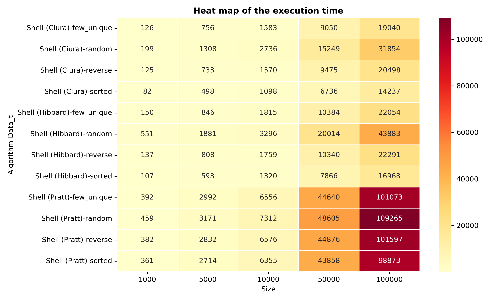

# Implementation of Algorithms (3rd Seminar) and Benchmarking of Shell Sorting

## Project Description

This project focuses on the implementation of algorithms from the seminar and an in-depth analysis of Shell sorting with various step sequences (increments).

### Key Achievements:
1. **Seminar Algorithms Implementation**: All algorithms from the seminar are implemented in the header file `algorithms.hpp`.

2. **Shell Sorting Benchmarking**: A specialized system was developed to measure the performance of three variants of Shell sorting (with steps proposed by Hibbard, Pratt, and Ciura) on various input data types (random, sorted, reverse, and with few unique elements). Testing was conducted on arrays of sizes from 1000 to 100000 elements. Results are saved in the CSV file `shell_sort_benchmark.csv` and visualized in the `img/` folder.

## Project Structure

```
├── include/
│ ├── algorithms.hpp
│ └── shell_bencmark.hpp
├── src/
│ ├── tester.cpp
│ └── shell_bencmark.cpp
├── img/
├── CMakeLists.txt
└── shell_sort_benchmark.csv
```

## How to install

```bash
git clone https://github.com/daniilgriga/VK_Algorithms_and_Data_Structures.git
cd VK_Algorithms_and_Data_Structures/sem_3
```

## How to build

```bash
mkdir build
cmake -S . -B build
cmake --build build
```

## Benchmarking Results

Benchmarking shows that the variant with steps proposed by Ciura demonstrates the best performance in all scenarios, especially on large arrays. Time is measured in microseconds (μs). All arrays are successfully sorted ``(Status: Sorted)``.

### Comparison by Input Data Types

#### Random (random data)
| Size | Hibbard (μs) | Pratt (μs) | Ciura (μs) |
|------|--------------|------------|------------|
| 1000 | 551 | 459 | 199 |
| 5000 | 1881 | 3171 | 1308 |
| 10000 | 3296 | 7312 | 2736 |
| 50000 | 20014 | 48605 | 15249 |
| 100000 | 43883 | 109265 | 31854 |

#### Sorted (sorted data)
| Size | Hibbard (μs) | Pratt (μs) | Ciura (μs) |
|------|--------------|------------|------------|
| 1000 | 107 | 361 | 82 |
| 5000 | 593 | 2714 | 498 |
| 10000 | 1320 | 6355 | 1098 |
| 50000 | 7866 | 43858 | 6736 |
| 100000 | 16968 | 98873 | 14237 |

#### Reverse (reverse order)
| Size | Hibbard (μs) | Pratt (μs) | Ciura (μs) |
|------|--------------|------------|------------|
| 1000 | 137 | 382 | 125 |
| 5000 | 808 | 2832 | 733 |
| 10000 | 1759 | 6576 | 1570 |
| 50000 | 10340 | 44876 | 9475 |
| 100000 | 22291 | 101597 | 20498 |

#### Few Unique (few unique elements)
| Size | Hibbard (μs) | Pratt (μs) | Ciura (μs) |
|------|--------------|------------|------------|
| 1000 | 150 | 392 | 126 |
| 5000 | 846 | 2992 | 756 |
| 10000 | 1815 | 6556 | 1583 |
| 50000 | 10384 | 44640 | 9050 |
| 100000 | 22054 | 101073 | 19040 |

### Heatmap of all measurements:


